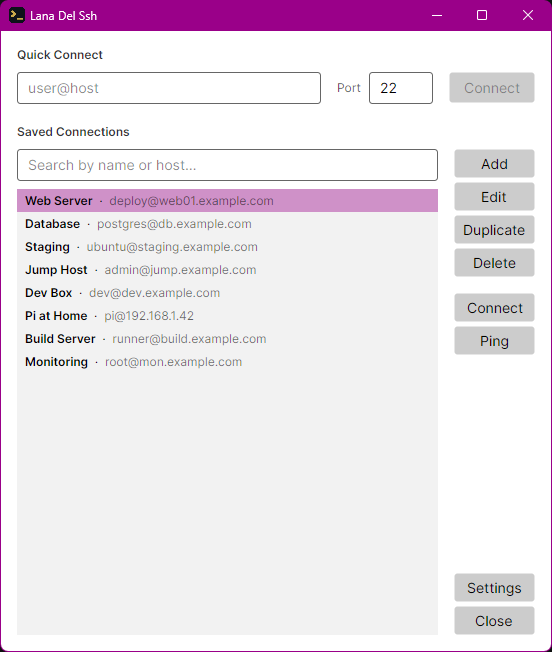
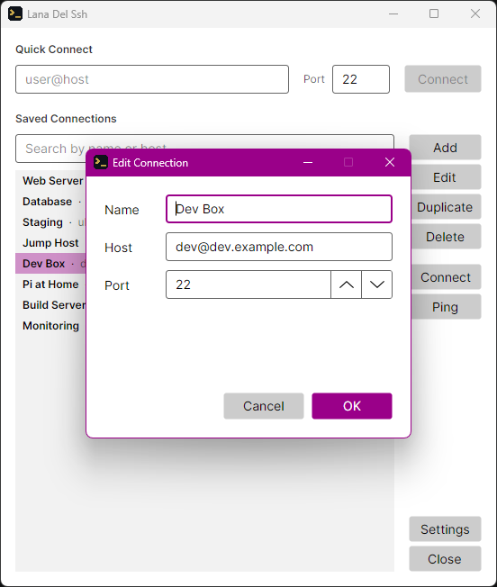
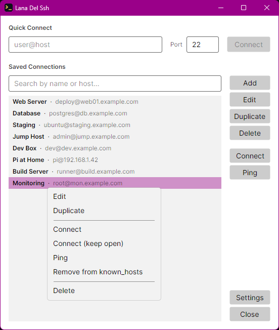
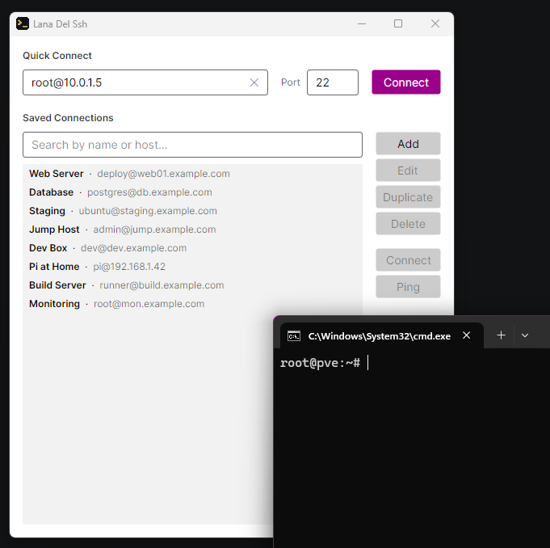
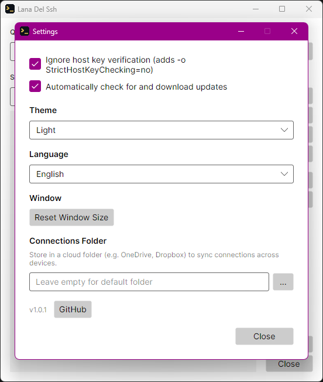
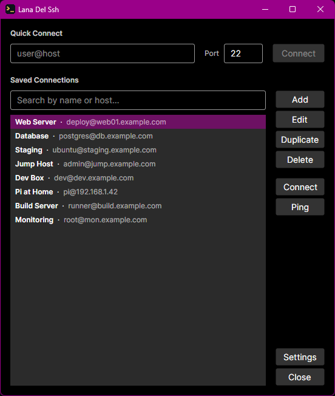
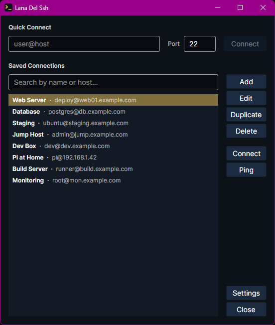

# Lana Del Ssh

**A cross-platform SSH connection manager** — save, organize, and launch SSH sessions with a single click. Built with C# and Avalonia UI.

<br clear="left"/>

---

## Download

| Platform | Installer |
|---|---|
| Windows x64 | [LanaDelSsh-win-x64-Setup.exe](https://github.com/WhereTheTimeWent/LanaDelSsh/releases/latest/download/LanaDelSsh-win-x64-Setup.exe) |
| Windows ARM64 | [LanaDelSsh-win-arm64-Setup.exe](https://github.com/WhereTheTimeWent/LanaDelSsh/releases/latest/download/LanaDelSsh-win-arm64-Setup.exe) |
| macOS Apple Silicon | [LanaDelSsh-osx-arm64-Setup.pkg](https://github.com/WhereTheTimeWent/LanaDelSsh/releases/latest/download/LanaDelSsh-osx-arm64-Setup.pkg) |
| macOS Intel | [LanaDelSsh-osx-x64-Setup.pkg](https://github.com/WhereTheTimeWent/LanaDelSsh/releases/latest/download/LanaDelSsh-osx-x64-Setup.pkg) |
| Linux x64 | [LanaDelSsh-linux-x64.AppImage](https://github.com/WhereTheTimeWent/LanaDelSsh/releases/latest/download/LanaDelSsh-linux-x64.AppImage) |
| Linux ARM64 | [LanaDelSsh-linux-arm64.AppImage](https://github.com/WhereTheTimeWent/LanaDelSsh/releases/latest/download/LanaDelSsh-linux-arm64.AppImage) |

> **Auto-updates:** Once installed, Lana Del Ssh checks for updates silently on startup and applies them automatically on the next launch. Auto-updates can be disabled in the Settings.

---

## Screenshots

### Main Window


### Add / Edit Connection


### Context Menu


### Launching an SSH Session


### Settings


### Dark Theme


### "Did you know that there's a tunnel under Ocean Blvd" Theme


---

## Features

- **Saved connections** — name, host, and port; double-click to open in your terminal
- **Quick Connect** — one-off connections without saving anything
- **Ping** — check if a host responds before trying to connect
- **Known hosts cleanup** — remove a host's entry from `~/.ssh/known_hosts` when its SSH key has changed (e.g. after an IP was reassigned to a different machine), so you can connect again without editing the file manually
- **Custom connection folder** — point the app at any folder, e.g. a cloud-synced one, to share connections across machines
- **Themes** — light, dark, system-auto, and *Did you know that there's a tunnel under Ocean Blvd* (a dark theme inspired by Lana Del Rey's album art)
- **English and German UI**
- **Auto-updates** via [Velopack](https://velopack.io)
- **Windows, macOS, Linux** (x64 and ARM64)

---

## Building from Source

```bash
# Prerequisites: .NET 10 SDK

# Build
dotnet build

# Run
dotnet run --project LanaDelSsh/LanaDelSsh.csproj

# Run tests
dotnet test
```

---

<sub>Did you know that there's an SSH tunnel under Ocean Blvd?</sub>
